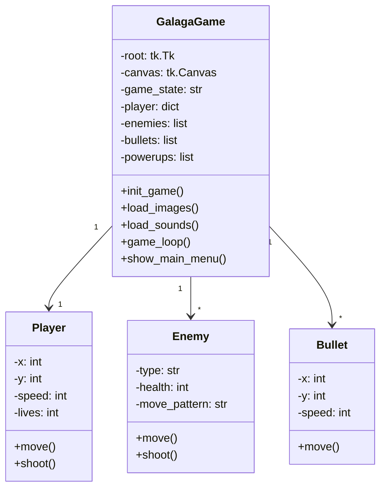
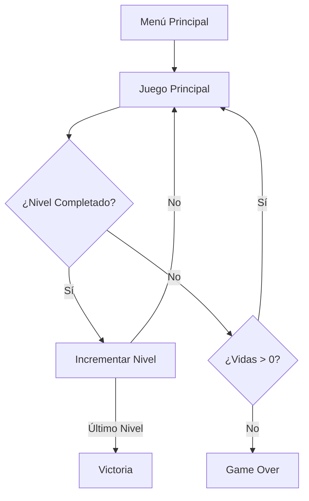

# Galaga-proyecto-POO
---

## **1. Introducción**  
**Galaga Advanced Pro** es un clon moderno del clásico juego de arcade *Galaga*, desarrollado en **Python** utilizando **Tkinter** para los gráficos y **Pygame** para los efectos de sonido. Este documento proporciona una descripción técnica detallada del juego, incluyendo su arquitectura, mecánicas, controles y posibles mejoras.  

---

## **2. Requisitos del Sistema**  

| **Componente**       | **Requisito Mínimo**       | **Recomendado**          |
|----------------------|----------------------------|--------------------------|
| **Sistema Operativo**| Windows 10 / macOS 10.15+ / Linux (X11) | Windows 11 / macOS 12+ |
| **Python**           | 3.7+                       | 3.9+                     |
| **RAM**              | 2 GB                       | 4 GB                     |
| **GPU**              | Integrada                  | Dedicada (OpenGL)        |
| **Resolución**       | 800×600                    | 1920×1080                |

### **Dependencias**  
```bash
pip install pillow pygame
```

---

## **3. Arquitectura del Juego**  

### **3.1. Diagrama de Clases Simplificado**  


### **3.2. Flujo del Juego**  


---

## **4. Mecánicas Detalladas**  

### **4.1. Movimiento del Jugador**  
- **Físicas**:  
  - Velocidad base: `8 píxeles/frame` (ajustable con `player_speed`).  
  - Movimiento suavizado con detección de bordes.  
  - Power-up de velocidad aumenta un **50%** temporalmente.  

### **4.2. Sistema de Disparos**  
| **Tipo**          | **Velocidad** | **Cadencia** | **Power-Up**          |
|-------------------|--------------|--------------|-----------------------|
| Normal            | 12 px/frame  | Instantáneo  | -                     |
| Doble (Power-Up)  | 12 px/frame  | Instantáneo  | Duración: 10 segundos |

### **4.3. Enemigos**  
| **Tipo**       | **Patrón de Movimiento** | **Comportamiento**                     | **Puntos** |
|----------------|--------------------------|----------------------------------------|------------|
| Básico         | Sinusoidal               | Disparos lentos                       | 100        |
| Avanzado       | Zigzag                   | Disparos rápidos                      | 150        |
| Transformable  | Circular                 | Se vuelve más fuerte                  | 200→300    |
| Kamikaze       | Persecución              | Acelera hacia el jugador              | 250        |
| **Jefe**       | Lento                    | Disparos en ráfaga + Mucha salud      | 1000       |

---

## **5. Sistema de Sonidos y Gráficos**  

### **5.1. Sonidos (Pygame Mixer)**  
| **Evento**         | **Archivo**      | **Descripción**                     |
|--------------------|------------------|-------------------------------------|
| Disparo            | `laser.wav`      | Efecto láser agudo                 |
| Explosión          | `explosion.wav`  | Sonido de explosión                |
| Power-Up           | `powerup.wav`    | Tono de mejora                     |
| Jefe Aparece       | `boss.wav`       | Música de alerta                   |
| Game Over          | `game_over.wav`  | Melodía de derrota                 |
| Victoria           | `victory.wav`    | Melodía de éxito                   |

### **5.2. Gráficos (Tkinter + Pillow)**  
- Si no se encuentran imágenes, el juego usa **formas geométricas**.  
- Sprites recomendados: **40×40 px** (jugador), **30×30 px** (enemigos).  

---

## **6. Optimización y Rendimiento**  

### **6.1. Técnicas Implementadas**  
✔ **Canvas Recycling**: Reutilización de objetos gráficos para evitar *lag*.  
✔ **Game Loop a 30 FPS**: Equilibrio entre fluidez y consumo de CPU.  

### **6.2. Posibles Cuellos de Botella**  
- Muchos enemigos en pantalla (>50).  
- Sonidos muy largos sin compresión.
- 
---

## **7. Extensibilidad y Mods**  

### **7.1. Cómo Añadir Nuevos Enemigos**  
1. Definir un nuevo tipo en `create_enemy_formation()`.  
2. Añadir su patrón de movimiento en `move_enemies()`.  
3. Incluir su puntuación en `check_collisions()`.  

### **7.2. Ejemplo: Enemigo Teleportador**  
```python
enemies.append({
    'id': canvas.create_oval(x-15, y-15, x+15, y+15, fill='blue'),
    'x': x,
    'y': y,
    'type': 'teleporter',
    'move_pattern': 'teleport',
    'teleport_cooldown': 100,
    'health': 2
})
```

---

## **8. Mejoras Futuras**  

| **Prioridad** | **Feature**                | **Descripción**                          |
|--------------|----------------------------|------------------------------------------|
| Alta         | Sistema de Partidas Guardadas | Guardar progreso entre niveles.         |
| Media        | Niveles con Diseño Único   | Fases con obstáculos y patrones fijos.  |
| Baja         | Multijugador Local         | Cooperativo o competitivo en pantalla partida. |

---

## **9. Conclusión**  
**Galaga** es un proyecto funcional con:  
✔ **4 tipos de enemigos + jefes**  
✔ **Sistema de power-ups**  
✔ **Guardado de puntuaciones**

## ** Notas de Version 2.0**
Contiene errores el nivel, actualmente esta version solo contiene aproximadamente 3 niveles ya que en su estructura de codigo hay un error.
Dicho error hace que los niveles no avancen progresivamente, es decir, del 1 al 2, del 2 al 3 y asi sucesivamente hasta el 10, de pronto en un futuro pueda corregirse,
o algun otro alumno del prof Pimienta en futuros grupos de POO puedan resolver este error e implementar mas mejoras a este proyecto
